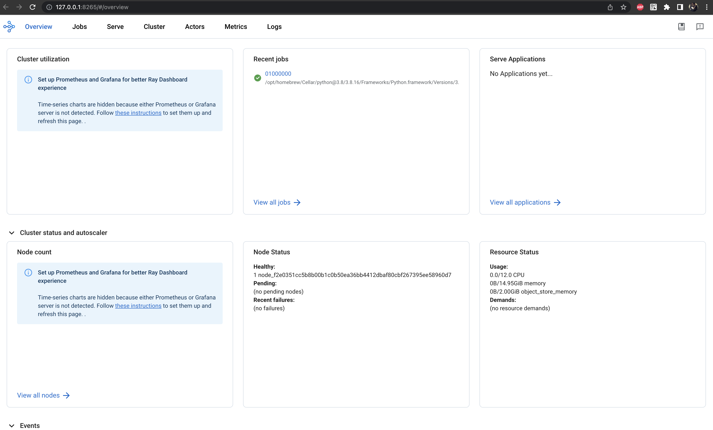
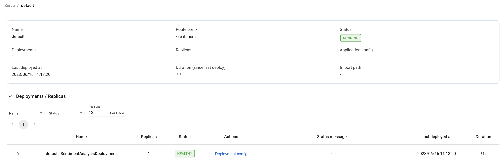
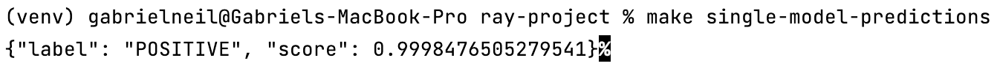
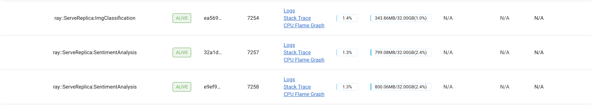

# ray-project

ray-project is a repository that showcases deployments of different kinds of models in an easy way.

## Installation

Clone or download the repository and navigate to the project directory. The only requirement is to have Python 3.8
installed. Please note that Ray does not currently work with Python 3.9 due to dependency reasons.

## Clone repo

```bash
git clone https://github.com/gabrielneil/ray-project.git
```

## Basic Usage

### Set up the environment and install dependencies.

```bash
make install
```

### Start Ray UI and an empty kubernetes cluster.

```bash
make start-and-serve
```

You can now access the Ray dashboard at http://127.0.0.1:8265.



### Deploy a single model in Ray.

```bash
make deploy-single-model
```

This will create a new node in your Kubernetes cluster and deploy a pretrained HuggingFace model for sentiment analysis
inside it.



### Stop Ray

The following command will destroy all infrastructure of Ray, including the endpoints.

```bash
make stop
```

### Test the first endpoint.

```bash
make single-model-predictions
```

## Ray + FastAPI Usage

### Deploy two or more models with Ray + FastAPI.

The main idea behind this example is to take advantage of the several benefits that FastAPI brings to our
infrastructure. In this case, we are deploying two models:

- Dummy PyTorch NN. (1 node)
- HuggingFace pretrained sentiment analysis. (2 nodes, because of replica config)

```bash
make deploy-multiple-models
```


Note: This approach puts all models in a single file for practice purposes. It is not recommended for production use.

### Test the sentiment analysis endpoint.

```bash
make multiple-models-predictions
```

## Contributing

Pull requests are welcome. For major changes, please open an issue first
to discuss what you would like to change.
